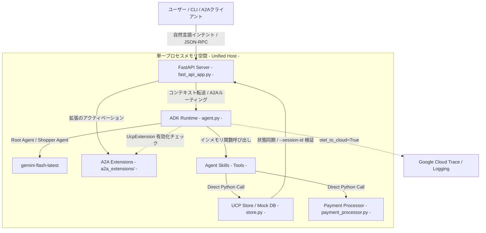

# samples-a2a

### English

This project (A2A version) is submitted to the **[DevOps × AI Agent Hackathon](https://findy.notion.site/devops-ai-agent-hackathon-2026)**, while [the REST API integration version](https://github.com/shogoorg/samples-rest) is submitted to the **[AI Agents: Intensive Vibe Coding Capstone Project](https://www.kaggle.com/competitions/vibecoding-agents-capstone-project)**. Each adopts the optimal architecture tailored to its respective hackathon requirements.

| Comparison Metric | A2A In-Memory Unified [This Project] | REST API Integration (Traditional Distributed) |
| :--- | :--- | :--- |
| Target Hackathon | DevOps × AI Agent Hackathon | AI Agents: Intensive Vibe Coding Capstone Project |
| **System Coupling** | Unified / Co-located | Decoupled |
| **Communication Flow** | The agent runtime and DB are co-located in a single FastAPI process, executing data operations directly in-memory | The agent and the merchant server communicate over the network via APIs |
| **Primary Benefits** | Zero network overhead for ultra-low latency; immune to network/transport failures, ensuring deterministic execution | Standard client-server structure, making it highly portable and easier to integrate with real production systems |
| **Multi-Agent / A2A** | Publishes JSON-RPC routes for Agent-to-Agent (A2A) communication, facilitating future collaborative multi-agent scenarios | Tailored for single-agent-to-server scenarios |

### 日本語 / Japanese

本プロジェクト（A2A版）は[DevOps × AI Agent Hackathon](https://findy.notion.site/devops-ai-agent-hackathon-2026)へ、もう一方の[REST API連携版](https://github.com/shogoorg/samples-rest)は「[AI Agents: Intensive Vibe Coding Capstone Project](https://www.kaggle.com/competitions/vibecoding-agents-capstone-project)」へそれぞれ提出されており、それぞれの目的や要件に合わせて最適なアーキテクチャを採用しています。

| 比較項目 | A2Aインメモリ一体型構成 [本作] | REST API連携構成 (分散型) |
| :--- | :--- | :--- |
| **提出先** | DevOps × AI Agent Hackathon| AI Agents: Intensive Vibe Coding Capstone Project |
| **システム結合度** | 密結合・インメモリ一体型 | 疎結合 |
| **通信形態** | 単一のFastAPIプロセス内にエージェントランタイムとモックDBを同居、インメモリで直接データ操作 | エージェントと加盟店サーバーがネットワーク経由で通信 |
| **主なメリット** | ネットワークオーバーヘッドが皆無で超高速。通信障害のリスクがなく、強固な決定論的実行が可能 | 標準的なクライアント・サーバー構成。既存の外部APIや実システムへの移行・統合が容易 |
| **エージェント間連携** | A2A通信用のJSON-RPCルートを公開。将来の複数エージェント協調シナリオをサポート | 単一エージェントとサーバーのやり取りに特化 |

---

### 概要

本プロジェクトは、[agents-cli](https://github.com/google/agents-cli) を使用して [Cymbal Retail Agent with UCP Extension and A2A](https://github.com/Universal-Commerce-Protocol/samples/tree/main/a2a) を実行可能にするものです。

agents-cliは、Gemini Enterprise Agent Platform 上でエージェントを構築するための CLI およびエージェントスキル（ライブラリ）です。

Cymbal Retail Agent（Python/FastAPI）は、Google の内外どちらでもデプロイできるように設計された、UCPとA2A拡張の参照実装です。

免責事項：本リポジトリは Cymbal Retail Agent with UCP Extension and A2Aのクローンおよび再利用バージョンであり、agents-cliを使用した対話型ショッピングフローおよびエージェントの検証をサポートするためにリファクタリングされています。

## プロジェクト構成

```
agent/
├── app/
│   ├── __init__.py
│   ├── a2a_extensions/        # A2Aプロトコル（UCP拡張仕様）の解決とアクティベーション
│   │   ├── base_extension.py
│   │   └── ucp_extension.py
│   ├── agent.py               # ADKエージェント定義およびツールのバインド
│   ├── fast_api_app.py        # FastAPIサーバー、A2Aルート、JSON-RPCハンドラー
│   ├── payment_processor.py   # インメモリ模擬決済ロジック
│   ├── store.py               # インメモリUCPストア（Mock DB）およびセッション同期
│   └── app_utils/             # アプリのユーティリティとヘルパー
├── data/
│   ├── products.json          # 小売店の静的データ（商品カタログ）
│   ├── ucp.json               # UCP設定プロファイル
│   └── gold_tasks.json        # agents-cli eval で使用する評価用ゴールドデータセット
├── tests/                     # ユニットテスト、統合テスト、負荷テスト
├── pyproject.toml             # uv 依存関係定義およびプロジェクトメタデータ
└── README.md                  # 本ドキュメント
```

## アーキテクチャ概要

本A2A版（samples-a2a）アーキテクチャの最大の特徴は、エージェント（ADK ランタイム）と加盟店ストアバックエンド（Mock DB / 決済ロジック）が、ネットワークを介さず単一のFastAPIホストプロセス内の同一メモリ空間にある（Co-located）点にあります。A2Aクライアント（他エージェント）との間では、JSON-RPC 2.0（`execute` メソッド）に準拠したメッセージングと、セッションIDによる状態同期を行います。



### コンポーネントの説明

1. **FastAPIサーバー (fast_api_app.py)**: エージェントランタイムをホストし、外部からの対話リクエストや将来的なエージェント間連携のためのJSON-RPCエンドポイントを公開します。
2. **A2A拡張モジュール (a2a_extensions/)**: A2Aクライアント（他エージェント）との通信において、UCP仕様などのプロトコル拡張の解決、および機能のアクティベーションを管理するネゴシエーション層です。
3. **ADKエージェント (agent.py)**: gemini-flash-latest をコアに、自然言語インテントの解釈から4ステップのコマースパイプライン（カタログ検索、カート追加、配送先設定、決済完了）を自律的に制御します。
4. **インメモリ状態管理・決済 (store.py, payment_processor.py)**: UCP A2A仕様に準拠したデータ操作ロジック。ネットワークを介さず、エージェントスキル（ツール）から直接Python関数として呼び出されます。

## アーキテクチャの詳細

1. **ビジネス課題の解決策**
   断片化されたAPIや手動の「バイブスチェック」によるシステム間連携の不具合、人的ミスを、ADKによる自律的なコマースオーケストレーションによって解決します。多言語での曖昧な入力に対しても、一貫した取引パイプラインを自動生成・実行します。
2. **既存ツールセットの活用**
   既存の加盟店ビジネスロジックや決済アセット（[store.py](agent/app/store.py), [payment_processor.py](agent/app/payment_processor.py)）を破棄することなく、ADKのデコレーター（`@tool`）を用いてそのままエージェントスキルとして統合。IT資産を最大化しつつ高速にAI化を実現します。
3. **決定論的なセキュリティガードレール**
   すべての対話およびインメモリ操作において、連続する端末コマンド全体で検証済みの `--session-id` フラグの要求を決定論的に強制します。これにより、プロンプトインジェクションやハルシネーションによる不正なカート改ざん（価格変更や数量の不正操作など）をシステム層でシャットアウトします。
4. **A2A 通信プロトコル**
   他の購買エージェントや加盟店エージェントと疎結合に連携するため、JSON-RPC 2.0 に準拠したメッセージング・インターフェースを標準実装しています。受信した `execute` メソッドおよびプロンプトパラメータに基づき、同一プロセス内のADKエージェントが自律的にインメモリDBを操作し、構造化された処理結果を即座に呼び出し元エージェントへ返します。
5. **再現可能なデプロイ構成**
   `agents-cli scaffold enhance` を介して、インフラのコード化（IaC: Terraform）とCI/CDパイプラインを自動生成。Google Cloud Run をターゲットとした本番品質のセキュアな環境を、コマンド一つで再現可能にします。

## 主要コード実装

### 1. エージェントの定義とツール登録 ([agent.py](agent/app/agent.py))
ADKを用いてエージェントを構築し、インメモリのストア操作関数を自律的ツールとしてバインドします。

```python
# app/agent.py
from google.adk import Agent
from google.adk.apps import App
from google.adk.models import Gemini

root_agent = Agent(
    name="shopper_agent",
    model=Gemini(
        model="gemini-flash-latest",
        retry_options=types.HttpRetryOptions(attempts=3),
    ),
    instruction="You are a helpful agent who can help user with shopping...",
    tools=[
        search_shopping_catalog,
        add_to_checkout,
        remove_from_checkout,
        update_checkout,
        get_checkout,
        start_payment,
        update_customer_details,
        complete_checkout,
    ],
    after_tool_callback=after_tool_modifier,
    after_agent_callback=modify_output_after_agent,
)

app = App(
    root_agent=root_agent,
    name="app",
)
```

### 2. エージェントランタイムサーバー ([fast_api_app.py](agent/app/fast_api_app.py))
FastAPIを使用してADKエージェントとA2Aルートを連携させ、クラウド実行環境をブートストラップします：

```python
# app/fast_api_app.py
@contextlib.asynccontextmanager
async def lifespan(app: FastAPI) -> AsyncIterator[None]:
    from app.agent import app as adk_app
    from app.agent import root_agent

    runner = Runner(
        app=adk_app,
        session_service=services.get_session_service(),
        artifact_service=services.get_artifact_service(),
        auto_create_session=True,
    )
    app.state.runner = runner
    app.state.agent_app_name = adk_app.name
    await attach_a2a_routes(
        app,
        agent=root_agent,
        runner=runner,
        task_store=InMemoryTaskStore(),
        rpc_path=f"/a2a/{adk_app.name}",
    )
    yield
```

### 3. A2Aプロトコル拡張とアクティベーション ([base_extension.py](agent/app/a2a_extensions/base_extension.py))
他のエージェントから要求されたUCP拡張仕様のネゴシエーション（合意）およびアクティベーションロジックをハンドリングします。

```python
# app/a2a_extensions/base_extension.py（一部抜粋）
class A2AExtensionBase(ABC):
    """A2A拡張仕様のベースクラス。AgentCard（メタデータ）への追加やアクティベートを処理します。"""
    URI: str

    def get_agent_extension(self) -> AgentExtension:
        return AgentExtension(
            uri=self.get_extension_uri(),
            description=self._description,
            required=False,
            params=self._params,
        )

    def activate(self, context: RequestContext) -> None:
        """リクエストコンテキストから要求された拡張URIを照合し、有効化します"""
        if not context.requested_extensions:
            return

        if self.get_extension_uri() in context.requested_extensions:
            context.add_activated_extension(self.get_extension_uri())
```

## ローカル開発手順

ローカル環境でエージェントをテスト・動作させるには、まず `agent` ディレクトリに移動します：
```bash
cd agent
```

### 依存関係のインストール
`agents-cli` および関連スキルをセットアップします（未実行の場合）：
```bash
uvx google-agents-cli setup
```

プロジェクト全体の依存関係をインストールします（未実行の場合のみ）：
```bash
agents-cli install
```

### ローカルサーバーの起動
他エージェントとのA2A通信エンドポイントをホストするローカルサーバーを起動します：
```bash
uv run uvicorn app.fast_api_app:app --reload --port 8000
```

### Web UIでの対話テスト
**別のターミナルを開き**（`cd agent` でディレクトリ移動後）、`agents-cli` 標準のプレイグラウンドUIを起動してブラウザ上でチャットテストを行います：
```bash
agents-cli playground
```
起動後、ブラウザで表示されるURLにアクセスして対話します。

### CLIからの対話テスト
**別のターミナルで**、セッションIDを指定して実行することで、一連のショッピングフロー（検索 ➔ カート追加 ➔ 配送先登録 ➔ 決済完了）を対話テストできます。

#### 日本語セッションでの実行例
```bash
# 1. 商品の検索テスト（初回はセッションIDの指定は不要です）
agents-cli run "在庫があるクッキーを見せてください"

# 2. カート追加テスト (BISC-001を追加)
# ※直前のコマンドが出力したセッションIDを指定して実行してください
agents-cli run "私のチェックアウトに BISC-001 を追加してください" --session-id <SESSION_ID>

# 3. 配送先情報の登録テスト
agents-cli run "私の配送情報を設定してください：名前は John Doe、住所は 1600 Amphitheatre Pkwy, Mountain View, CA、郵便番号は 94043、メールアドレスは john.doe@example.com です" --session-id <SESSION_ID>

# 4. 決済完了テスト
agents-cli run "今すぐ私のチェックアウトを完了してください" --session-id <SESSION_ID>
```

#### 英語セッションでの実行例（別のセッションとして実行）
```bash
# 1. 商品の検索テスト（初回はセッションIDの指定は不要です）
agents-cli run "Show me cookies in stock"

# 2. カート追加テスト (BISC-001を追加)
# ※直前のコマンドが出力したセッションIDを指定して実行してください
agents-cli run "Add BISC-001 to my checkout" --session-id <SESSION_ID>

# 3. 配送先情報の登録テスト
agents-cli run "Set my shipping info: name is John Doe, address is 1600 Amphitheatre Pkwy, Mountain View, CA, postal code is 94043, email is john.doe@example.com" --session-id <SESSION_ID>

# 4. 決済完了テスト
agents-cli run "Complete my checkout now" --session-id <SESSION_ID>
```

### 事前検証と品質チェック
サーバーを起動する前に、コードの健全性とエージェントの基本性能を検証します。

#### 自動評価（ACLI Eval）の実行
エージェントがカート操作や配送先設定などの各コマースツールを正しく呼び出せるかを自動採点します（評価データセットは [basic-dataset.json](agent/tests/eval/datasets/basic-dataset.json) に定義されています）。
```bash
agents-cli eval generate
agents-cli eval grade
```

## デプロイ

エージェントおよび統合された UCP バックエンドを Google Cloud Run にデプロイします。

### 1. デプロイ構成とTerraformの追加
`agents-cli scaffold enhance` を実行し、CI/CDパイプラインとTerraform構成を追加します。
```bash
agents-cli scaffold enhance --deployment-target cloud_run
```

### 2. デプロイの実行
gcloudのプロジェクト設定を確認し、デプロイを実行します。
```bash
# 1. Google Cloud プロジェクトを設定
gcloud config set project <YOUR_GCP_PROJECT_ID>

# 2. デプロイの実行
agents-cli deploy --no-confirm-project

# 3. エージェントサービスを一般公開 (必要な場合のみ)
# ※ インターネット経由で呼び出すために必要です
gcloud run services add-iam-policy-binding agent \
  --member="allUsers" \
  --role="roles/run.invoker" \
  --region=us-east1 \
  --project=<YOUR_GCP_PROJECT_ID>
```

実行が完了すると、本番環境に対応した一般公開可能かつスケール可能なサービスURLが出力されます。
このサービスURLに対して、以下のエンドポイントが公開されます：

* **A2A外部エンドポイント (JSON-RPC 2.0)**:
  `https://<YOUR_CLOUD_RUN_URL>/a2a/app` （他のエージェントからのリクエストを受信するエンドポイント）
* **A2Aエージェントカード (メタデータ定義)**:
  `https://<YOUR_CLOUD_RUN_URL>/a2a/app/.well-known/agent-card.json` （エージェントの機能や対応言語などを記述したDiscovery用JSONファイル）

> ⚠️ **一般公開に関するセキュリティ警告:**
> `allUsers` への公開は、インターネット上の誰でもエージェントを呼び出せるようになるため、Gemini API等の予期せぬ課金が発生するリスクがあります。また、組織ポリシーによって制限されている場合は失敗します。本番環境では適切な認証を設定してください。

**デプロイステータスは以下で確認できます：**
```bash
agents-cli deploy --status
```

## コマンド一覧

| コマンド | 説明 |
| :--- | :--- |
| `agents-cli install` | uv を使用してエージェントの依存関係をインストールします |
| `agents-cli playground` | ローカル開発用のプレイグラウンド（Web UI）を起動します |
| `agents-cli lint` | コード品質チェック（静的解析）を実行します |
| `agents-cli eval` | エージェントの動作評価（グレーディング）を実行します |
| `uv run pytest tests/unit tests/integration` | ユニットテストおよび統合テストを実行します |

## プロジェクト管理

| コマンド | 説明 |
| :--- | :--- |
| `agents-cli scaffold enhance` | CI/CD パイプラインと Terraform インフラ構成を追加します |
| `agents-cli infra cicd` | CI/CD パイプラインとインフラ全体をワンコマンドでセットアップします |
| `agents-cli scaffold upgrade` | カスタマイズを保持したまま最新バージョンに自動アップグレードします |

## オブザーバビリティ

実運用（とどけるフェーズ）における可観測性を担保するため、エンタープライズ向けのOpenTelemetry設定を有効化しています。
エージェント定義において `otel_to_cloud=True` を設定することにより、エージェントの推論プロセス、インメモリのツール実行トレース、セッション状態の遷移データが以下の Google Cloud コンポーネントへ自動的にエクスポートされ、リアルタイムの監視と監査を可能にします。

- **Cloud Trace**: エージェントのツール呼び出し（インメモリ関数）のレイテンシと実行パスの可視化
- **Cloud Logging**: プロンプトインジェクション検出やエラーハンドリングのログ記録

## デモ

本プロジェクトの動作や開発・評価ワークフローを紹介するデモ動画です。

* **デモ動画 1 (YouTube)**: [https://youtu.be/hfwU5jKTzXc](https://youtu.be/hfwU5jKTzXc)
  * **動画の構成 (再生時間: 1分29秒)**:
    プロジェクトの特徴を分かりやすく簡潔に紹介するため、動画は以下の2つのセグメントで構成されています。
    * **日本語によるデモ**: 端末で日本語プロンプトを使用し、製品カタログ検索からチェックアウト、決済完了までのE2E（エンドツーエンド）の4ステップ商取引パイプラインを実演します。
    * **英語によるデモ**: 端末で英語プロンプトを使用して同様の4ステップ商取引パイプラインを実演し、エージェントの多言語対応および堅牢なセッション状態追跡機能を紹介します。
* **デモ動画 2 (YouTube)**: [https://youtu.be/P6X4SSsoNEc](https://youtu.be/P6X4SSsoNEc)
  * **動画の構成**:
    CLI（`agents-cli`）を用いたエージェントのセットアップ、起動、対話型テスト、および評価の実行ワークフローを実演しています。
    * **セットアップと起動**: `agents-cli install`、Uvicornによるローカルサーバー起動、および `agents-cli playground` の起動。
    * **CLIによる対話型テスト**: `agents-cli run` を使用し、セッションIDを引き継ぎながら日本語と英語のプロンプトでショッピングから決済完了までを実行。
    * **評価の実行**: `agents-cli eval generate` および `agents-cli eval grade` による評価データの生成と自動採点の実行。
