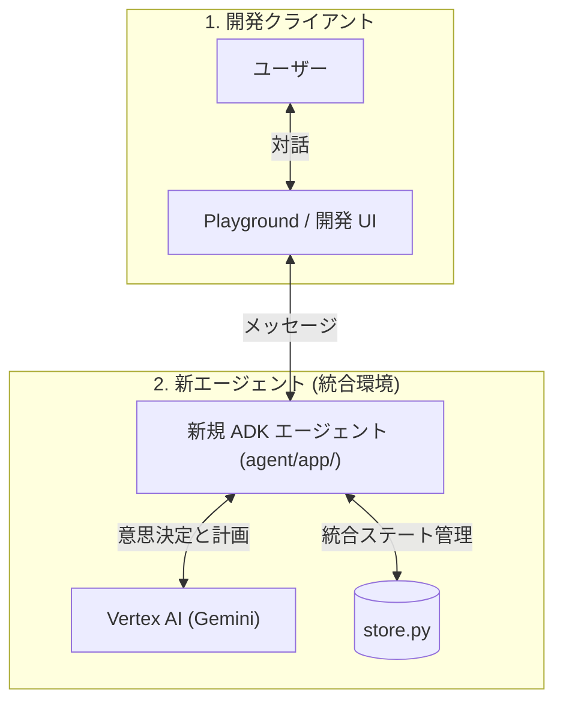

# samples-a2a

このプロジェクトは、`agents-cli` を使用して UCP 拡張および A2A（Agent-to-Agent）に対応した Cymbal Retail エージェントを実行するためのものです。

`agents-cli` は、Gemini Enterprise Agent Platform 上でエージェントを構築するための CLI およびスキルです。詳細な仕様は [Universal-Commerce-Protocol/samples](https://github.com/Universal-Commerce-Protocol/samples/tree/main/rest/python/server) を参照してください。

UCP（Universal Commerce Protocol）は、コマースプラットフォーム、加盟店、決済プロバイダー間の相互運用性を可能にするオープンスタンダードです。このエージェントは、UCP 規格およびその A2A 実装を参照して、AI 搭載 of ショッピングアシスタントを構築するデモを示しています。詳細は [Cymbal Retail Agent with UCP Extension and A2A](https://github.com/Universal-Commerce-Protocol/samples/tree/main/a2a) を参照してください。

免責事項:このリポジトリは、Cymbal Retail Agent with UCP Extension and A2A のクローンおよび再利用バージョンであり、インタラクティブなショッピング フローとエージェント検証をサポートするためにリファクタリングされていますagents-cli


## プロジェクト構成

```
agent/
├── app/                       # エージェントのコアコード (ADK)
│   ├── agent.py               # メインのエージェントロジック (買い物アシスタント)
│   ├── fast_api_app.py        # FastAPI バックエンドサーバー
│   ├── store.py               # 統合された小売店ステート管理 (Mock DB)
│   ├── payment_processor.py   # 決済プロセッサーロジック
│   ├── app_utils/             # アプリのユーティリティとヘルパー
│   └── data/                  # 小売店の静的データ (products.json, ucp.json)
├── tests/                     # ユニットテスト、統合テスト、負荷テスト
├── GEMINI.md                  # AI 支援開発ガイド
└── pyproject.toml             # プロジェクトの依存関係定義
```

> 💡 **Tip:** AI 支援開発には [Antigravity CLI](https://antigravity.google/) を使用してください。プロジェクトのコンテキストは `GEMINI.md` に事前設定されています。

## アーキテクチャ概要



### コンポーネントの説明

1. **新規 ADK エージェント (agent/app/)**
   - **概要**: メインサーバーとして構成された独立した ADK プロジェクト。
   - **役割**: 従来の加盟店エージェントから移植されたビジネスロジック（`store.py` および商品カタログ）を統合して動作するアクティブなサーバー。

2. **Playground / 開発 UI**
   - **概要**: `agents-cli` が提供する対話型のローカル開発 UI。
   - **役割**: ローカル環境で ADK エージェントの動作テストや対話を行うためのユーザーインターフェース。

## 事前準備

開始する前に、以下がインストールされていることを確認してください。
- **uv**: Python パッケージマネージャー (このプロジェクトのすべての依存関係管理に使用) — [インストール方法](https://docs.astral.sh/uv/getting-started/installation/)
- **agents-cli**: エージェント CLI — `uv tool install google-agents-cli` でインストール
- **Google Cloud SDK**: GCP サービス用 — [インストール方法](https://cloud.google.com/sdk/docs/install)

## クイックスタート

このエージェントは、UCP 規格および A2A 実装を参照し、顧客のショッピングからチェックアウト、決済完了までのフロー全体をシミュレートします。

`agents-cli` および関連スキルをセットアップします（未実行の場合のみ）：

```bash
uvx google-agents-cli setup
```

必要な依存パッケージをインストールします：

```bash
agents-cli install
```

対話型のローカル開発用プレイグラウンドを起動します：

```bash
agents-cli playground
```

または、ターミナルから直接コマンドを実行して、ショッピングフロー全体をテストすることも可能です：

```bash
# 1. 商品の検索テスト
agents-cli run "在庫があるクッキーを見せてください"

# 2. カート追加テスト (BISC-001を追加)
# ※直前のコマンドが出力した --session-id を付与してセッションを維持してください
agents-cli run "私のチェックアウトに BISC-001 を追加してください" --session-id <SESSION_ID>

# 3. 配送先情報の登録テスト
agents-cli run "私の配送情報を設定してください：名前は John Doe、住所は 1600 Amphitheatre Pkwy, Mountain View, CA、郵便番号は 94043、メールアドレスは john.doe@example.com です" --session-id <SESSION_ID>

# 4. 決済完了テスト
agents-cli run "今すぐ私のチェックアウトを完了してください" --session-id <SESSION_ID>
```

## 使用可能なコマンド

| コマンド | 説明 |
| :--- | :--- |
| `agents-cli install` | uv を使用してエージェントの依存パッケージをインストールします。 |
| `agents-cli playground` | ローカル開発用プレイグラウンド（Web UI）を起動します。 |
| `agents-cli lint` | コードの品質チェック（静的解析）を実行します。 |
| `agents-cli eval run --dataset <path>` | 指定したデータセットを使用してエージェントの動作を評価します。 |
| `uv run pytest tests/unit tests/integration` | ユニットテストおよび統合テストを実行します。 |

## 🛠️ プロジェクト管理

| コマンド | 説明 |
| :--- | :--- |
| `agents-cli scaffold enhance` | CI/CD パイプラインと Terraform インフラ定義を追加します。 |
| `agents-cli infra cicd` | CI/CD パイプラインとインフラ全体をワンコマンドでセットアップします。 |
| `agents-cli scaffold upgrade` | カスタマイズ内容を維持したまま、自動的に最新バージョンにアップグレードします。 |

---

## 開発

エージェントのロジックは `agent/app/agent.py` で編集します。`agents-cli playground` を起動している場合、ファイルを保存すると自動的にリロードされます。

## デプロイ

ADK エージェントを Cloud Run にデプロイし、一般公開します：

```bash
agents-cli deploy --project=<YOUR_PROJECT_ID> --no-confirm-project
```

## オブザーバビリティ (観測性)

組み込みのテレメトリー機能により、Cloud Trace、BigQuery、および Cloud Logging へデータが自動的にエクスポートされます。

## A2A インスペクター

このエージェントは [A2A プロトコル](https://a2a-protocol.org/) をサポートしています。相互運用性のテストには [A2A Inspector](https://github.com/a2aproject/a2a-inspector) を使用してください。詳細は [A2A Inspector のドキュメント](https://github.com/a2aproject/a2a-inspector) を参照してください。
