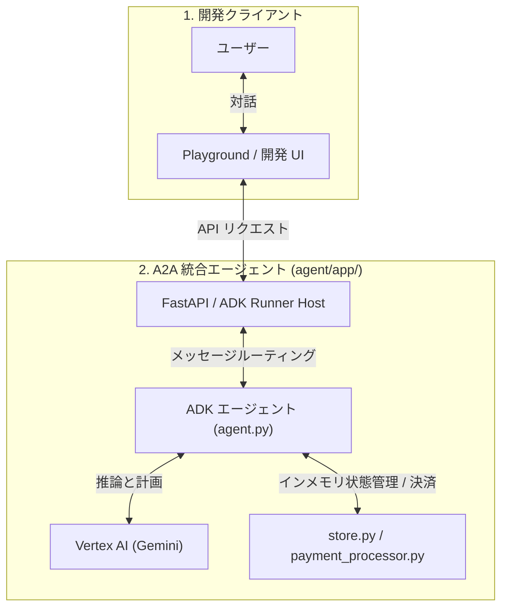

# samples-a2a

このプロジェクトは、`agents-cli` を使用して UCP 拡張および A2A（Agent-to-Agent）に対応した Cymbal Retail エージェントを実行するためのものです。

`agents-cli` は、Gemini Enterprise Agent Platform 上でエージェントを構築するための CLI およびスキルです。

UCP（Universal Commerce Protocol）は、コマースプラットフォーム、加盟店、決済プロバイダー間の相互運用性を可能にするオープンスタンダードです。このエージェントは、UCP 規格およびその A2A 実装を参照して、AI 搭載ショッピングアシスタントを構築するデモを示しています。

免責事項：このリポジトリは、Cymbal Retail Agent with UCP Extension and A2A のクローンおよび再利用バージョンであり、インタラクティブなショッピング フローとエージェント検証をサポートするためにリファクタリングされています。

## プロジェクト構成

```
agent/
├── app/                       # エージェントのコアコード (ADK 2.0)
│   ├── agent.py               # メインのエージェントロジック (買い物アシスタント)
│   ├── fast_api_app.py        # FastAPI バックエンドサーバー (ADK 統合)
│   ├── store.py               # 統合された小売店ステート管理 (Mock DB)
│   ├── payment_processor.py   # 決済プロセッサーロジック
│   ├── app_utils/             # アプリのユーティリティとヘルパー
│   └── data/                  # 小売店の静的データ (products.json, ucp.json)
├── tests/                     # ユニットテスト、統合テスト、負荷テスト
├── GEMINI.md                  # AI 支援開発ガイド
└── pyproject.toml             # プロジェクトの依存関係定義
```

> 💡 **Tip:** AI 支援開発には [Antigravity CLI](https://antigravity.google/) を使用してください。プロジェクトのコンテキストは `GEMINI.md` に事前設定されています。

## アーキテクチャ概要

A2A（Agent-to-Agent）構成では、バックエンド機能（FastAPIサーバー）とエージェントランタイム（ADK 2.0）が1つのプロセスに統合（インメモリ同居）されています。



### 💡 REST版（[samples-rest](https://github.com/shogoorg/samples-rest)）とのアーキテクチャの違い

ハッカソンに同時提出するREST版（Python REST Agent）と本A2A版は、アプローチが異なります。

| 比較項目 | REST版 (samples-rest) | A2A版 (samples-a2a) |
| :--- | :--- | :--- |
| **システム結合度** | **疎結合 (Decoupled)** | **密結合・インメモリ一体型 (Unified/Co-located)** |
| **通信形態** | エージェント（Client）と加盟店サーバー（FastAPI）が**ネットワーク（REST API）経由で通信** | 単一のFastAPIプロセス内にエージェントランタイムとモックDBを同居させ、**インメモリで直接データ操作** |
| **主なメリット** | 標準的なクライアント・サーバー構成で、実システムへの移行・既存APIとの統合が容易 | ネットワークオーバーヘッドが皆無で超高速。通信エラーがなく、強固な決定論的実行が可能 |
| **エージェント間連携** | 単一エージェントとサーバーのやり取りに特化 | **A2A（Agent-to-Agent）通信用のJSON-RPCルート**を公開し、将来的な複数エージェント間連携をサポート |

### コンポーネントの説明

1. **FastAPI / ADK Runner Host (`fast_api_app.py`)**
   - **概要**: エージェントランタイムをホストし、A2Aルーティングルートを公開する統合Webサーバー。
   - **役割**: クライアントや他のエージェントからのメッセージを受信し、ADK Runnerを介してエージェントモデルに処理を委ねます。
2. **ADK エージェント (`agent.py`)**
   - **概要**: Gemini APIと連携する自律ショッピングエージェント。
   - **役割**: カタログ検索、カート管理、配送先登録、決済などの意思決定を行い、統合されたスキル（ツール）を実行します。
3. **インメモリ状態管理 / 決済 (`store.py` / `payment_processor.py`)**
   - **概要**: 加盟店のコアビジネスロジック。
   - **役割**: カタログ商品データや、セッションごとのカート状態、決済処理をインメモリで直接管理します。

## アーキテクチャの詳細 (Architectural Breakdown)

1. **ビジネス上の課題とエージェントによる解決策:**
   従来の企業の調達・取引ワークフローは、複雑なAPI連携と人為的ミスが発生しやすい課題がありました。本ソリューションでは、静的なスクリプトを状態管理機能付きの対話型エージェントに置き換えます。`shopper_agent` は自然言語による柔軟なユーザー案内を行いつつ、実際の実行処理は決定論的なスキル（ツール）パスに制限します。
2. **既存ツールセットの巧みな活用 (インメモリ統合):**
   REST API経由の疎結合な通信を行うのではなく、A2A実装では Cymbal Retail の既存のバックエンドロジック（`store.py` や `payment_processor.py`）を直接ADKエージェントのスキル（ツール関数）にインポートしてバインドしています。これにより、エージェントはローカルのモックDBデータを直接操作でき、極めて高速かつ決定論的な処理を可能にしています。
3. **決定論的なセキュリティガードレール:**
   決済や注文などの重要な金融操作では、LLMのハルシネーションは許されません。カート状態、顧客情報、最終決済などのコアトランザクション変数は、LLMコアから完全に分離された状態でツールにより処理されます。また、コマンド間でセッションを維持するために `--session-id` の検証を強制することで、プロンプトインジェクションや不正なカート改ざんを防ぎます。
4. **再現可能なデプロイアーキテクチャ:**
   システム全体がクラウドに最適化されています。エージェントランタイムとAPIサーバー（`fast_api_app.py`）が1つのコンテナに統合されており、`agents-cli scaffold enhance` を通じて Terraform 構成を生成後、`agents-cli deploy` のワンコマンドで **Google Cloud Run** にデプロイ可能です。

## 主要なコード実装 (Key Implementations)

システム設計の参考となる、エージェントの推論とプラットフォーム構成を実装するコアコードです。

#### 1. エージェントの定義とツール登録 (`app/agent.py`)
`shopper_agent` にビジネスロジックを処理する決定論的なツール群（インメモリでの商品検索やチェックアウト更新）をバインドしています：

```python
# app/agent.py
root_agent = Agent(
    name="root_agent",
    model=Gemini(
        model="gemini-flash-latest",
        retry_options=types.HttpRetryOptions(attempts=3),
    ),
    instruction="You are a helpful agent who can help user with shopping...",
    tools=[
        search_shopping_catalog,
        add_to_checkout,
        remove_from_checkout,
        update_checkout,
        get_checkout,
        start_payment,
        update_customer_details,
        complete_checkout,
    ],
    after_tool_callback=after_tool_modifier,
    after_agent_callback=modify_output_after_agent,
)

app = App(
    root_agent=root_agent,
    name="app",
)
```

#### 2. エージェントランタイムサーバー (`app/fast_api_app.py`)
FastAPIを使用してADKエージェントとA2Aルートを連携させ、クラウド実行環境をブートストラップします：

```python
# app/fast_api_app.py
@contextlib.asynccontextmanager
async def lifespan(app: FastAPI) -> AsyncIterator[None]:
    from app.agent import app as adk_app
    from app.agent import root_agent

    runner = Runner(
        app=adk_app,
        session_service=services.get_session_service(),
        artifact_service=services.get_artifact_service(),
        auto_create_session=True,
    )
    app.state.runner = runner
    app.state.agent_app_name = adk_app.name
    await attach_a2a_routes(
        app,
        agent=root_agent,
        runner=runner,
        task_store=InMemoryTaskStore(),
    )
    yield
```

## 事前準備

開始する前に、以下がインストールされていることを確認してください。
- **uv**: Python パッケージマネージャー (このプロジェクトのすべての依存関係管理に使用) — [インストール方法](https://docs.astral.sh/uv/getting-started/installation/)
- **agents-cli**: エージェント CLI — `uv tool install google-agents-cli` でインストール
- **Google Cloud SDK**: GCP サービス用 — [インストール方法](https://cloud.google.com/sdk/docs/install)

## クイックスタート

### 1. 依存関係のインストール
`agents-cli` および関連スキルをセットアップします（未実行の場合のみ）：

```bash
uvx google-agents-cli setup
```

プロジェクト全体のPythonパッケージをインストールします：

```bash
agents-cli install
```

### 2. ローカルでの起動とテスト
対話型のローカル開発用プレイグラウンドを起動して、エージェントをテストします：

```bash
agents-cli playground
```

### 3. コマンドラインからのテスト
ターミナルから直接コマンドを実行して、ショッピングフロー全体をテストすることも可能です：

```bash
# 1. 商品の検索テスト
agents-cli run "在庫があるクッキーを見せてください"

# 2. カート追加テスト (BISC-001を追加)
# ※直前のコマンドが出力した --session-id を付与してセッションを維持してください
agents-cli run "私のチェックアウトに BISC-001 を追加してください" --session-id <SESSION_ID>

# 3. 配送先情報の登録テスト
agents-cli run "私の配送情報を設定してください：名前は John Doe、住所は 1600 Amphitheatre Pkwy, Mountain View, CA、郵便番号は 94043、メールアドレス is john.doe@example.com です" --session-id <SESSION_ID>

# 4. 決済完了テスト
agents-cli run "今すぐ私のチェックアウトを完了してください" --session-id <SESSION_ID>
```

## デプロイ (Deployment)

エージェントおよび統合された UCP バックエンドを Google Cloud Run にデプロイします。

### 1. デプロイターゲットの追加
プロジェクトに Cloud Run デプロイ用の構成を追加します：

```bash
agents-cli scaffold enhance --deployment-target cloud_run
```

### 2. デプロイの実行
Google Cloud プロジェクトを設定し、デプロイを実行します：

```bash
# 1. Google Cloud プロジェクトを設定
gcloud config set project <YOUR_PROJECT_ID>

# 2. デプロイを実行
agents-cli deploy --project=<YOUR_PROJECT_ID> --no-confirm-project

# 3. エージェントサービスを一般公開 (必要な場合のみ)
gcloud run services add-iam-policy-binding samples-a2a \
  --member="allUsers" \
  --role="roles/run.invoker" \
  --region=us-east1 \
  --project=<YOUR_PROJECT_ID>
```

> ⚠️ **一般公開に関するセキュリティ警告:**
> `allUsers` への公開は、インターネット上の誰でもエージェントを呼び出せるようになるため、Gemini API等の予期せぬ課金が発生するリスクがあります。また、組織ポリシーによって制限されている場合は失敗します。本番環境では適切な認証を設定してください。

デプロイステータスは以下で確認できます：

```bash
agents-cli deploy --status
```

## コマンド一覧 (Commands)

| コマンド | 説明 |
| :--- | :--- |
| `agents-cli install` | uv を使用してエージェントの依存関係をインストールします |
| `agents-cli playground` | ローカル開発用のプレイグラウンド（Web UI）を起動します |
| `agents-cli lint` | コード of 品質チェック（静的解析）を実行します |
| `agents-cli eval` | エージェントの動作評価（グレーディング）を実行します |
| `uv run pytest tests/unit tests/integration` | ユニットテストおよび統合テストを実行します |

## プロジェクト管理 (Project Management)

| コマンド | 説明 |
| :--- | :--- |
| `agents-cli scaffold enhance` | CI/CD パイプラインと Terraform インフラ構成を追加します |
| `agents-cli infra cicd` | CI/CD パイプラインとインフラ全体をワンコマンドでセットアップします |
| `agents-cli scaffold upgrade` | カスタマイズを保持したまま最新バージョンに自動アップグレードします |

## オブザーバビリティ (Observability)

Cloud Trace、BigQuery、Cloud Logging へのテレメトリデータ（実行トレースやログ）の自動エクスポートが組み込まれています。
