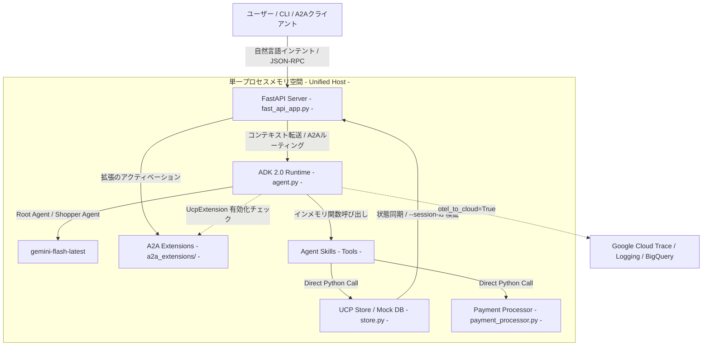

# Cymbal Retail A2A Unified Agent Architecture

本プロジェクトは、Gemini Enterprise Agent Platform (ADK 2.0) を活用し、エンタープライズの商取引における自動化と絶対的な信頼性を両立させるための参照実装です。 UCP（Universal Commerce Protocol）A2A拡張仕様に基づき、エージェントランタイムとバックエンドロジックを単一プロセス内にインメモリで統合することで、従来の分散システムが抱えていたネットワーク遅延や通信障害リスクを根本から排除した「インメモリ一体型（Unified/Co-located）A2Aアーキテクチャ」を提供します。さらに、agents-cli を通じた自動評価・CI/CDパイプラインを統合し、モダンなDevOpsプロセスに準拠したAIエージェント開発サイクルを実証します。

免責事項: 本プロジェクトは Cymbal Retail Agent with UCP Extension and A2A のクローンおよび再利用バージョンであり、agents-cli を使用した対話型ショッピングフローとエージェント検証をサポートするためにリファクタリングされています。

## プロジェクト構成

```
agent/
├── app/
│   ├── __init__.py
│   ├── a2a_extensions/        # A2Aプロトコル（UCP拡張仕様）の解決とアクティベーション
│   │   ├── base_extension.py
│   │   └── ucp_extension.py
│   ├── agent.py               # ADK 2.0エージェント定義およびツールのバインド
│   ├── fast_api_app.py        # FastAPIサーバー、A2Aルート、JSON-RPCハンドラー
│   ├── payment_processor.py   # インメモリ模擬決済ロジック
│   ├── store.py               # インメモリUCPストア（Mock DB）およびセッション同期
│   └── app_utils/             # アプリのユーティリティとヘルパー
├── data/
│   ├── products.json          # 小売店の静的データ（商品カタログ）
│   ├── ucp.json               # UCP設定プロファイル
│   └── gold_tasks.json        # agents-cli eval で使用する評価用ゴールドデータセット
├── tests/                     # ユニットテスト、統合テスト、負荷テスト
├── pyproject.toml             # uv 依存関係定義およびプロジェクトメタデータ
└── README.md                  # 本ドキュメント
```

## アーキテクチャ概要

本A2A版（samples-a2a）アーキテクチャの最大の特徴は、エージェント（ADK 2.0 ランタイム）と加盟店ストアバックエンド（Mock DB / 決済ロジック）が、ネットワークを介さず単一のFastAPIホストプロセス内の同一メモリ空間に同居（Co-located）している点にあります。


※ A2Aクライアント（他エージェント）との間では、JSON-RPC 2.0（`execute` メソッド）に準拠したメッセージングと、セッションIDによる状態同期を行います。

### REST版（samples-rest）とのアーキテクチャの違い

ハッカソンに同時提出するREST版（samples-rest）とは、システム結合度および通信の決定論性の面で明確なアプローチの差別化を行っています。

| 比較項目 | REST版 (samples-rest) | A2A版 (samples-a2a) [本作] |
| :--- | :--- | :--- |
| **システム結合度** | 疎結合 (Decoupled) | 密結合・インメモリ一体型 (Unified / Co-located) |
| **通信形態** | エージェントと加盟店サーバーがネットワーク（UCP準拠REST API）経由で通信 | 単一のFastAPIプロセス内にエージェントランタイムとモックDBを同居、インメモリで直接データ操作 |
| **主なメリット** | 標準的なクライアント・サーバー構成。既存の外部APIや実システムへの移行・統合が容易 | ネットワークオーバーヘッドが皆無で超高速。通信障害のリスクがなく、強固な決定論的実行が可能 |
| **エージェント間連携** | 単一エージェントとサーバーのやり取りに特化 | A2A（Agent-to-Agent）通信用のJSON-RPCルートを公開。将来の複数エージェント協調シナリオをサポート |

### コンポーネントの説明

1. **FastAPIサーバー (`fast_api_app.py`)**: エージェントランタイムをホストし、外部からの対話リクエストや将来的なエージェント間（Agent-to-Agent）連携のためのJSON-RPCエンドポイントを公開します。
2. **A2A拡張モジュール (`a2a_extensions/`)**: A2Aクライアント（他エージェント）との通信において、UCP仕様などのプロトコル拡張の解決、および機能のアクティベーションを管理するネゴシエーション層です。
3. **ADKエージェント (`agent.py`)**: gemini-flash-latest をコアに、自然言語インテントの解釈から7ステップのコマースパイプライン（カタログ検索、カート追加、チェックアウト、決済）を自律的に制御します。
4. **インメモリ状態管理・決済 (`store.py`, `payment_processor.py`)**: UCP A2A仕様に準拠したデータ操作ロジック。ネットワークを介さず、エージェントスキル（ツール）から直接Python関数として呼び出されます。

## アーキテクチャの詳細 (Architectural Breakdown)

1. **ビジネス課題の解決策 (Business Solution)**
   断片化されたAPIや手動の「バイブスチェック」によるシステム間連携の不具合、人的ミスを、ADK 2.0による自律的なコマースオーケストレーションによって解決します。多言語での曖昧な入力に対しても、一貫した取引パイプラインを自動生成・実行します。
2. **既存ツールセットの活用 (Leveraging Tools)**
   既存の加盟店ビジネスロジックや決済アセット（`store.py`, `payment_processor.py`）を破棄することなく、ADK 2.0のデコレーター（`@tool`）を用いてそのままエージェントスキルとして統合。IT資産を最大化しつつ高速にAI化を実現します。
3. **決定論的なセキュリティガードレール (Security Guardrails)**
   すべての対話およびインメモリ操作において、連続する端末コマンド全体で検証済みの `--session-id` フラグの要求を決定論的に強制します。これにより、プロンプトインジェクションやハルシネーションによる不正なカート改ざん（価格変更や数量の不正操作など）をシステム層でシャットアウトします。
4. **A2A (Agent-to-Agent) 通信プロトコル**
   他の購買エージェントや加盟店エージェントと疎結合に連携するため、JSON-RPC 2.0 に準拠したメッセージング・インターフェースを標準実装しています。受信した `execute` メソッドおよびプロンプトパラメータに基づき、同一プロセス内のADKエージェントが自律的にインメモリDBを操作し、構造化された処理結果を即座に呼び出し元エージェントへ返します。
5. **再現可能なデプロイ構成 (Reproducible Deployment)**
   `agents-cli scaffold enhance` を介して、インフラのコード化（IaC: Terraform）とCI/CDパイプラインを自動生成。Google Cloud Run をターゲットとした本番品質のセキュアな環境を、コマンド一つで再現可能にします。

## 主要コード実装 (Key Implementations)

### 1. エージェントの定義とツール登録 (`app/agent.py`)
ADK 2.0を用いてエージェントを構築し、インメモリのストア操作関数を自律的ツールとしてバインドします。

```python
# app/agent.py
from google.adk import Agent
from google.adk.apps import App
from google.adk.models import Gemini

root_agent = Agent(
    name="shopper_agent",
    model=Gemini(
        model="gemini-flash-latest",
        retry_options=types.HttpRetryOptions(attempts=3),
    ),
    instruction="You are a helpful agent who can help user with shopping...",
    tools=[
        search_shopping_catalog,
        add_to_checkout,
        remove_from_checkout,
        update_checkout,
        get_checkout,
        start_payment,
        update_customer_details,
        complete_checkout,
    ],
    after_tool_callback=after_tool_modifier,
    after_agent_callback=modify_output_after_agent,
)

app = App(
    root_agent=root_agent,
    name="app",
)
```

### 2. エージェントランタイムサーバー (`app/fast_api_app.py`)
FastAPIを使用してADKエージェントとA2Aルートを連携させ、クラウド実行環境をブートストラップします：

```python
# app/fast_api_app.py
@contextlib.asynccontextmanager
async def lifespan(app: FastAPI) -> AsyncIterator[None]:
    from app.agent import app as adk_app
    from app.agent import root_agent

    runner = Runner(
        app=adk_app,
        session_service=services.get_session_service(),
        artifact_service=services.get_artifact_service(),
        auto_create_session=True,
    )
    app.state.runner = runner
    app.state.agent_app_name = adk_app.name
    await attach_a2a_routes(
        app,
        agent=root_agent,
        runner=runner,
        task_store=InMemoryTaskStore(),
        rpc_path=f"/a2a/{adk_app.name}",
    )
    yield
```

### 3. A2Aプロトコル拡張とアクティベーション (`app/a2a_extensions/base_extension.py`)
他のエージェントから要求されたUCP拡張仕様のネゴシエーション（合意）およびアクティベーションロジックをハンドリングします。

```python
# app/a2a_extensions/base_extension.py（一部抜粋）
class A2AExtensionBase(ABC):
    """A2A拡張仕様のベースクラス。AgentCard（メタデータ）への追加やアクティベートを処理します。"""
    URI: str

    def get_agent_extension(self) -> AgentExtension:
        return AgentExtension(
            uri=self.get_extension_uri(),
            description=self._description,
            required=False,
            params=self._params,
        )

    def activate(self, context: RequestContext) -> None:
        """リクエストコンテキストから要求された拡張URIを照合し、有効化します"""
        if not context.requested_extensions:
            return

        if self.get_extension_uri() in context.requested_extensions:
            context.add_activated_extension(self.get_extension_uri())
```

## 事前準備

開始する前に、以下がインストールされていることを確認してください。
- **uv**: Python パッケージマネージャー (このプロジェクトのすべての依存関係管理に使用) — [インストール方法](https://docs.astral.sh/uv/getting-started/installation/)
- **agents-cli**: エージェント CLI — `uv tool install google-agents-cli` でインストール
- **Google Cloud SDK (gcloud)**: GCP サービス用 — [インストール方法](https://cloud.google.com/sdk/docs/install)

## クイックスタート

エージェントプロジェクトのディレクトリに移動します：
```bash
cd agent
```

### 1. 依存関係のインストール
`agents-cli` および関連スキルをセットアップします（未実行の場合のみ）：
```bash
uvx google-agents-cli setup
```

プロジェクト全体の依存関係をインストールします：
```bash
agents-cli install
```

### 2. ローカルサーバーの起動 (A2A Server)
他エージェントとのA2A通信エンドポイントをホストするローカルサーバーを起動します：
```bash
uv run uvicorn app.fast_api_app:app --reload --port 8000
```

### 3. Web UIでの対話テスト (Playground)
**別のターミナルを開き**（`cd agent` でディレクトリ移動後）、`agents-cli` 標準のプレイグラウンドUIを起動してブラウザ上でチャットテストを行います：
```bash
agents-cli playground
```
起動後、ブラウザで表示されるURL（通常は `http://localhost:3000` など）にアクセスして対話します。

### 4. CLIからの対話テスト (CLI Test)
**別のターミナルで**、セッションIDを指定して実行することで、一連のショッピングフロー（検索 ➔ カート追加 ➔ 配送先登録 ➔ 決済完了）を対話テストできます。

#### 日本語セッションでの実行例
```bash
# 1. 商品の検索テスト（初回はセッションIDの指定は不要です）
agents-cli run "在庫があるクッキーを見せてください"

# 2. カート追加テスト (BISC-001を追加)
# ※直前のコマンドが出力したセッションIDを指定して実行してください
agents-cli run "私のチェックアウトに BISC-001 を追加してください" --session-id <SESSION_ID>

# 3. 配送先情報の登録テスト
agents-cli run "私の配送情報を設定してください：名前は John Doe、住所は 1600 Amphitheatre Pkwy, Mountain View, CA、郵便番号は 94043、メールアドレスは john.doe@example.com です" --session-id <SESSION_ID>

# 4. 決済完了テスト
agents-cli run "今すぐ私のチェックアウトを完了してください" --session-id <SESSION_ID>
```

#### 英語セッションでの実行例（別のセッションとして実行）
```bash
# 1. 商品の検索テスト（初回はセッションIDの指定は不要です）
agents-cli run "Show me cookies in stock"

# 2. カート追加テスト (BISC-001を追加)
# ※直前のコマンドが出力したセッションIDを指定して実行してください
agents-cli run "Add BISC-001 to my checkout" --session-id <SESSION_ID>

# 3. 配送先情報の登録テスト
agents-cli run "Set my shipping info: name is John Doe, address is 1600 Amphitheatre Pkwy, Mountain View, CA, postal code is 94043, email is john.doe@example.com" --session-id <SESSION_ID>

# 4. 決済完了テスト
agents-cli run "Complete my checkout now" --session-id <SESSION_ID>
```

## デプロイ (Deployment)

エージェントおよび統合された UCP バックエンドを Google Cloud Run にデプロイします。

### 1. デプロイ構成とTerraformの追加 (IaC)
`agents-cli scaffold enhance` を実行し、CI/CDパイプラインとTerraform構成を追加します。
```bash
agents-cli scaffold enhance --deployment-target cloud_run
```

### 2. デプロイの実行
gcloudのプロジェクト設定を確認し、デプロイを実行します。
```bash
# 1. Google Cloud プロジェクトを設定
gcloud config set project <YOUR_GCP_PROJECT_ID>

# 2. デプロイの実行
agents-cli deploy --no-confirm-project

# 3. エージェントサービスを一般公開 (必要な場合のみ)
# ※ インターネット経由で呼び出すために必要です
gcloud run services add-iam-policy-binding agent \
  --member="allUsers" \
  --role="roles/run.invoker" \
  --region=us-east1 \
  --project=<YOUR_GCP_PROJECT_ID>
```

実行が完了すると、本番環境に対応した一般公開可能かつスケール可能なサービスURLが出力されます。
このサービスURLに対して、以下のエンドポイントが公開されます：

* **A2A外部エンドポイント (JSON-RPC 2.0)**:
  `https://<YOUR_CLOUD_RUN_URL>/a2a/app` （他のエージェントからのリクエストを受信するエンドポイント）
* **A2Aエージェントカード (メタデータ定義)**:
  `https://<YOUR_CLOUD_RUN_URL>/a2a/app/.well-known/agent-card.json` （エージェントの機能や対応言語などを記述したDiscovery用JSONファイル）

> ⚠️ **一般公開に関するセキュリティ警告:**
> `allUsers` への公開は、インターネット上の誰でもエージェントを呼び出せるようになるため、Gemini API等の予期せぬ課金が発生するリスクがあります。また、組織ポリシーによって制限されている場合は失敗します。本番環境では適切な認証を設定してください。

**デプロイステータスは以下で確認できます：**
```bash
agents-cli deploy --status
```

## コマンド一覧 (Commands)

| コマンド | 説明 |
| :--- | :--- |
| `agents-cli install` | uv を使用してエージェントの依存関係をインストールします |
| `agents-cli playground` | ローカル開発用のプレイグラウンド（Web UI）を起動します |
| `agents-cli lint` | コード品質チェック（静的解析）を実行します |
| `agents-cli eval` | エージェントの動作評価（グレーディング）を実行します |
| `uv run pytest tests/unit tests/integration` | ユニットテストおよび統合テストを実行します |

## プロジェクト管理 (Project Management)

| コマンド | 説明 |
| :--- | :--- |
| `agents-cli scaffold enhance` | CI/CD パイプラインと Terraform インフラ構成を追加します |
| `agents-cli infra cicd` | CI/CD パイプラインとインフラ全体をワンコマンドでセットアップします |
| `agents-cli scaffold upgrade` | カスタマイズを保持したまま最新バージョンに自動アップグレードします |

## オブザーバビリティ (Observability)

実運用（とどけるフェーズ）における可観測性を担保するため、エンタープライズ向けのOpenTelemetry設定を有効化しています。
エージェント定義において `otel_to_cloud=True` を設定することにより、エージェントの推論プロセス、インメモリのツール実行トレース、セッション状態の遷移データが以下の Google Cloud コンポーネントへ自動的にエクスポートされ、リアルタイムの監視と監査を可能にします。

- **Cloud Trace**: エージェントのツール呼び出し（インメモリ関数）のレイテンシと実行パスの可視化
- **Cloud Logging**: プロンプトインジェクション検出やエラーハンドリングのログ記録
